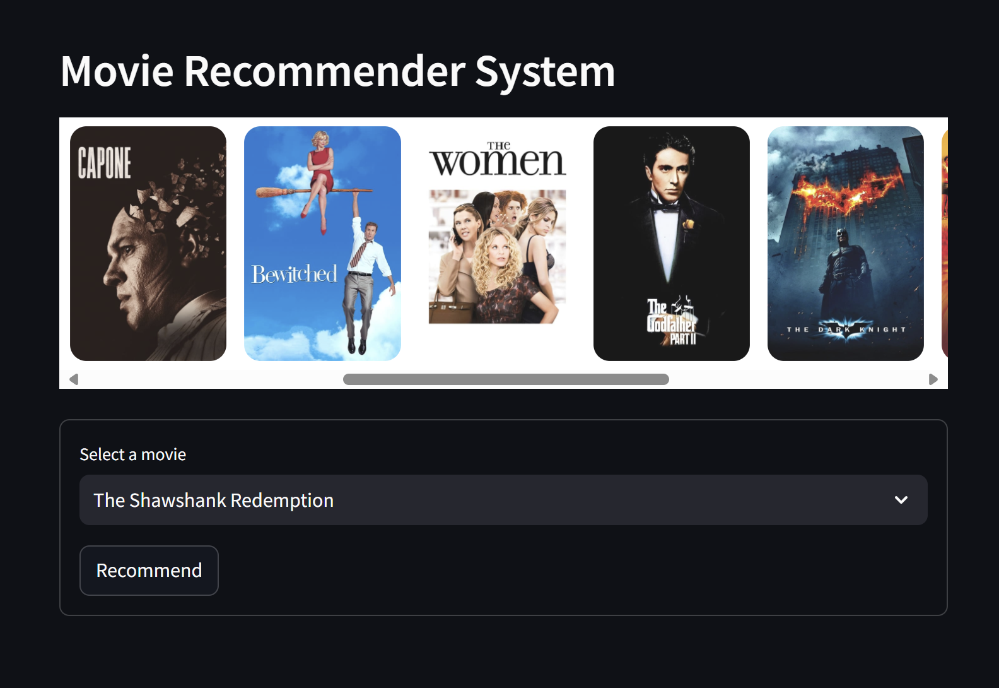

# Movie Recommendation System

## Description
A movie recommender system built using machine learning and a content-based recommendation approach. The system provides movie suggestions based on user preferences and interactions.

## Features
- Recommend movies similar to a selected movie
- Fetch movie posters using an external API
- Interactive interface built with Streamlit

## Setup and Installation

### Prerequisites
1. Python 3.x
2. Required libraries listed in `requirements.txt`

### Steps to Run the Project
1. Clone the repository to your local machine:
    ```bash
    git clone https://github.com/your-username/movie-recommender.git
    ```
2. Navigate to the project directory:
    ```bash
    cd movie-recommender
    ```
3. Install the dependencies:
    ```bash
    pip install -r requirements.txt
    ```
4. Run the Streamlit application:
    ```bash
    streamlit run app.py
    ```

## Usage
- Select a movie from the dropdown.
- The system will recommend similar movies based on the content of the selected movie.
- The system will also display movie posters for the recommended movies.

## Technologies Used
- Python
- Streamlit
- Pandas
- Requests
- Movie-DB API (for fetching movie posters)


# Movie Recommendation System

## Screenshots

### User Interface


*Here is a screenshot showing the user interface of the movie recommendation system.*


*Another screenshot displaying a list of recommended movies based on the user's selection.*


## License
This project is licensed under the MIT License.
